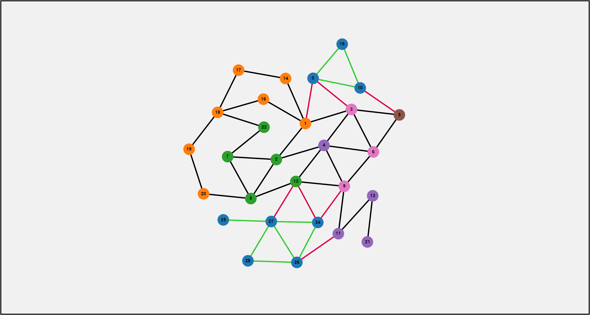

# SocialNetworkAlgorithm (Saharath Kleips)
Simulation project for CPE 400. [D3js](https://d3js.org) was used to create the graph.  

Visit https://zarol.github.io/SocialNetworkAlgorithm/ for a live demo.  

This project seeks to be used as a visual aid and simulation on the implementation of a "Social Network" routing protocol. A social network routing protocol establishes the concepts of "friends" when transmitting data between large distances. Suppose you are a client, "A," and you wish to send data to client "B." If there is a direct connection between A and B, then there is little worry about your data being intercepted or sniffed; your privacy is maintained. Now assume two more clients, C and D, both equidistant away from A and B. C has been known to read any data it receives, however, D is very trusted. In this scenario, you would prefer to transmit data through D to B (A->D->B) over C (A->C->B). This concept spawns the idea of a Social Network, in which routers / clients / etc. maintain a friends list (a list of trusted peers). A central server would be able to maintain a list of all clients and respond with the most optimal path determined by each client's friends list. The motivation here is privacy, rather than efficiency, such that if D in the last example was further from A and B than C, A would still chooose to transmit through D.  

The simulation I have developed maintains a high-level view of how a central server could determine paths between friends. More information may be found in the report. 

## Contact Information
**LinkedIn:** http://www.linkedin.com/in/SaharathKleips  
**Email:** SaharathKleips@gmail.com